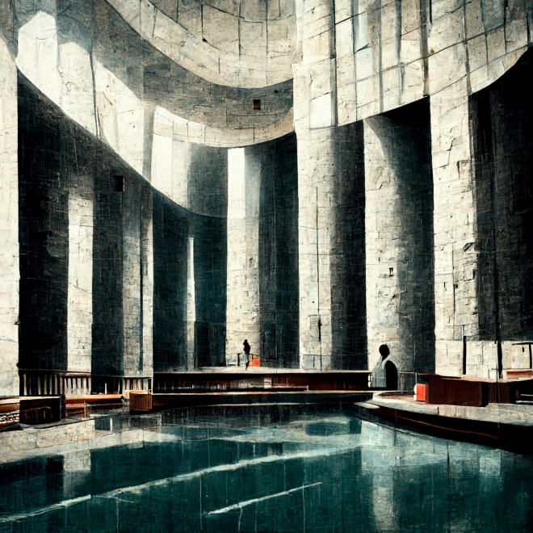

# Slices of Music 

This is a collection of audio files for your listening entertainment. 

_Image generated using Midjourney_

Between 2021 and 2022, I spent a lot of time exploring new methods of writing music. The methods include concepts of algebra, trigonometry, and programmer's combinatorics. The work is then applied as SuperCollider source code, which renders the concepts to audio file. 

A highly interesting aspect of these methods is scalability. Traditional music composition is not at all scalable in that you must explicitly write every note for every part. 

Here I am able to generalize the notes that go into a set of parts. As a result, each of the source files represents a space of recordings. Each recording is simply one permutation of thousands of possible alternatives. 

In other words, these methods enable a person to _mass produce reliably good music (without a neural network)_. 

The title of each recording comes directly from the filename from which it was generated. For a few of the better templates, I made extra renditions. When a title ends with `-a`, `-b`, or `-c`, that means it is another permutation of that template. 

You will see the word "study" appear in the titles. I consider most of these to be etudes. 

## ! <3 !

My goals over the next year is to take these discoveries and turn them into proper music. If you would like to support this pursuit of New Music, please join me in support [via Patreon](https://www.patreon.com/cortlandmahoney). 

These recordings are available under an adapted MIT license. Take them and have fun sampling! 
